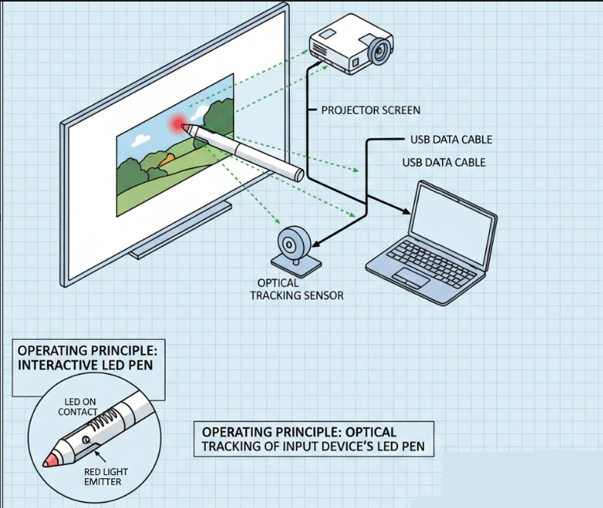
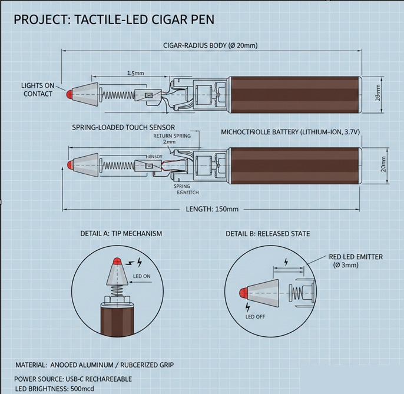

# Touch Projector (LEPEN-Based Non-Touch to Touch Conversion)

This repository is about turning a normal non-touch projector surface into a touch-interactive surface using computer vision and a LEPEN device.

## Final Project Folder
The final working project is in:
- `Touch-Projectors/`

All other folders in this repository are trial/experimental versions developed during the project journey.

## What This Project Does
- Captures camera feed from the projection area
- Calibrates the projected screen using corner selection
- Detects the LEPEN tip/marker on the surface
- Maps detected touch point to screen coordinates
- Triggers mouse click interaction so projected content can be controlled like touch

In simple terms: this project makes a regular projector behave like a touch projector using LEPEN and vision-based tracking.

## Working Steps (End-to-End)
1. Open `RemoteCam` on the phone and start the video stream (VDO feed).
2. Connect that phone stream URL in `Touch-Projectors/source.py`:
   - `cap = cv2.VideoCapture("http://<PHONE_IP>:4747/video")`
3. Run the main script:
   - `python Touch-Projectors/source.py`
4. A calibration window opens. Click 4 projector corners in the order shown by the script:
   - Top left, Top right, Bottom right, Bottom left
5. After calibration, point LEPEN to the projected surface.
6. When LEPEN touches (red LED glows), phone camera detects that red light spot.
7. The script maps that detected point to screen coordinates and triggers touch/click accordingly.
8. You can now interact with projected content like a touch screen.

The RemoteCam folder is where the RemoteCam app is developed and tested.
## Setup and Device
### System Setup

### LEPEN Device

## Main Script
- `Touch-Projectors/source.py`

## How It Works (Math from `source.py`)
### 1) Perspective Calibration (Projector Plane Mapping)
The script collects 4 clicked points from camera view:
- `pts = [(x1,y1), (x2,y2), (x3,y3), (x4,y4)]`

It defines output rectangle points:
- `AR = (740, 1280)`  (height, width)
- `oppts = [[0,0], [1280,0], [0,740], [1280,740]]`

Then it computes a homography (perspective transform):
- `Map = cv2.getPerspectiveTransform(ippts, oppts)`
- `warped = cv2.warpPerspective(image, Map, (1280, 740))`

This converts the angled camera view into a top-down calibrated touch plane.

### 2) LED Detection (Color Segmentation)
Frames are preprocessed with blur + gamma correction:
- `adjusted = adjust_gamma(blurred, gamma)`

Then converted to HSV and thresholded:
- `mask = cv2.inRange(hsv, lower, upper)`

For this script:
- `lower = (0, 65, 200)`
- `upper = (90, 175, 255)`

Contours are extracted from the binary mask, and the largest contour is used as LEPEN LED candidate.
Center is computed using image moments:
- `cx = M["m10"]/M["m00"]`
- `cy = M["m01"]/M["m00"]`

### 3) Coordinate Mapping to Screen
Detected point `(a, b)` is normalized using warped resolution `(1280 x 740)`:
- `m = (a / 1280) * 100`
- `n = (b / 740) * 100`

Mapped to actual monitor size `(width, height)`:
- `k = (width * m) / 100`
- `c = (height * n) / 100`

Equivalent direct form:
- `k = width * (a / 1280)`
- `c = height * (b / 740)`

So camera-space touch position becomes real screen-space pointer position.

### 4) Touch/Click Decision
If LED contour radius is valid (`radius > 1`), the script marks touch as active and sends mouse click using `pynput`.
This is how LEPEN contact is translated into projector touch input.

## Core Technologies
- Python
- OpenCV
- NumPy
- PyAutoGUI
- pynput
